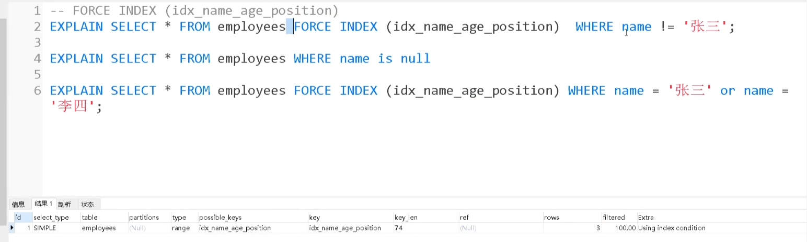

# SQl关系型数据库

## 一、关系型数据库基础知识
### 【1】字段
* 元组：数据库中的一列数据
* 码：能唯一标识元组的字段集合
  * 候选码：唯一标识元组的最小字段集合（不唯一：因为可能同时有多种字段组合能用一样最少数量的字段就能表示各个元组）
  * 主键/主码：候选码中的一种组合（唯一）
  * 外键/外码：用于建立和维护两张表的关系，一个表的外键一定是另一个表的主键
  * 主属性：所有候选组合中出现的字段都算主属性
  * 非主属性：未出现在任何候选码组合中的字段都是非主属性

### 【2】E-R图（entity-relationship diagram）
* 实体：数据库中的对象，矩形表示
* 属性：实体拥有的字段属性，椭圆表示
* 联系：表示两个实体之间关系（业务关系和数量对照关系），菱形表示


### 【3】范式（针对的是某一张表，但是受益的是整一个数据库）
#### 1、第一范式：所有字段的值唯一，不能一个属性字段存储多个值
```text
id	name	phones
1	Tom	123456,789012
```
#### 2、第二范式：第一范式基础上，消除非主属性对码的部分函数依赖
```text
不满足第二范式的情况
（学号，课程号）->课程名   课程号->课程名
```


缺点：
* 数据冗余：同一门课被100名学生选择就需要额外存储100次课程名（存储100各课程号是必须的，课程号是主键）
* 维护一致性成本高：需要修改课程名时，需要修改多条数据
* 插入异常？：课程名依赖于选课关系，如果没有选课关系，课程名无法插入到数据库中记录

#### 3、第三范式：第二范式基础上，消除非主属性对码的传递函数依赖
```text
传递函数依赖:
学生学号->学院号->学院名 且 无法直接从学生学号->学院名
```

缺点：
* 数据冗余：同一学院同时加入100名学生就需要额外存储100次学院名（存储100个学院号是必须的，但是学院号不算主键）   
* 维护一致性成本高：需要修改学院名时，需要修改多条数据
* 插入异常？：学院名依赖于学生与学院关系，如果某一学院初始化时没有学生，学院名无法插入到数据库中记录

#### 范式的作用
* 核心是在数据库设计上优化增删改查性能
* 最大的优势是将多个元组用到的同一类数据进行整合，并分到另一个表进行隔离，将多个字段数据压缩成一个外键与外表进行连接。

### 【4】sql与NoSQL的区别

| 对比维度 | SQL 数据库 | NoSQL 数据库 |
|----------|------------|---------------|
| 数据存储模型 | 结构化存储，具有固定行和列的表格 | 非结构化存储。文档：JSON 文档；键值：键值对；宽列：包含行和动态列的表；图：节点和边 |
| 发展历程 | 开发于 1970 年代，重点是减少数据重复 | 开发于 2000 年代后期，重点是提升可扩展性，减少大规模数据的存储成本 |
| 例子 | Oracle、MySQL、Microsoft SQL Server、PostgreSQL | 文档：MongoDB、CouchDB；键值：Redis、DynamoDB；宽列：Cassandra、HBase；图：Neo4j、Amazon Neptune、Giraph |
| **ACID 属性** | 提供原子性、一致性、隔离性和持久性（ACID）属性 | 通常不支持 ACID 事务，为了可扩展、高性能进行了权衡，少部分支持（如 MongoDB）。不过 MongoDB 对 ACID 事务的支持和 MySQL 还是有所区别的 |
| 性能 | 性能通常取决于磁盘子系统。要获得最佳性能，通常需要优化查询、索引和表结构 | 性能通常由底层硬件集群大小、网络延迟以及调用应用程序来决定 |
| 扩展 | 垂直扩展（使用性能更强大的服务器进行扩展）、读写分离、分库分表 | 横向扩展（增加服务器的方式横向扩展，通常基于分片机制） |
| 用途 | 普通企业级项目的数据存储 | 用途广泛，例如图数据库支持分析和遍历连接数据之间的关系，键值数据库可以处理大量数据扩展和极高的状态变化 |
| 查询语法 | 结构化查询语言（SQL） | 数据访问语法可能因数据库而异 |


## 二、MYSQL
### 【1】SQL语句
#### 1、DDL语句：对象为整张表/视图的语句
CREATE、ALTER、DROP、TRUNCATE、RENAME

```SQL
CREATE TABLE employees (
    id INT PRIMARY KEY AUTO_INCREMENT,
    name VARCHAR(50) NOT NULL,
    email VARCHAR(100) UNIQUE,
    department VARCHAR(50) DEFAULT '未分配',
    dept_id INT FOREIGN KEY REFERENCES departments(id)
);
```
字段约束：

| 约束 | 关键字 | 含义 |
|------|--------|------|
| 主键 | `PRIMARY KEY` | 唯一标识一行，不能重复、不能为空 |
| 唯一 | `UNIQUE` | 该列所有值不能重复（但允许NULL） |
| 非空 | `NOT NULL` | 不能为空值 |
| 默认值 | `DEFAULT` | 若不指定值，则使用默认值 |
| 外键 | `FOREIGN KEY` | 关联另一张表的主键（保证数据一致性） |
| 自动递增 | `AUTO_INCREMENT` | 通常用于主键，自动生成1,2,3... |


对比drop，truncate，delete三类删除操作
* drop：删除表结构和所有数据（DDL表操作），但是无法事务回滚
* truncate：保留表结构，删除所有数据（DDL表操作），但是无法事务回滚
* delete：保留表结构，删除where条件筛选出来的数据行（DML元组操作），且可以事务回滚

#### 2、select语句
##### (1) 单表查询语句
```SQL
查询:
SELECT [DISTINCT] 列名1, 列名2, ...   -- 要查询哪些列（字段约束）
FROM 表名                           -- 从哪个表查
[WHERE 条件]                        -- 筛选行（哪些记录）
[GROUP BY 列名]                     -- 分组
[HAVING 分组后条件]                  -- 分组后筛选
[ORDER BY 列名 [ASC|DESC]]          -- 排序
[LIMIT [偏移量,] 行数]               -- 限制返回行数
```


**执行顺序:**
from -> where -> group by -> having -> select -> order by-> limit

**group by 与order by区别：**
* `group by A` 是将A字段相同的所有列合并为一列输出（注意不是将A字段相同的组全部输出一个范围内）
* `order by A` 执行与分组后，所以是按照A字段将各个组排序（注意不是各个组内排序）

**Having与where的区别：**
* `where`：在select前执行，是原数据的筛选条件（注意此时使用的聚合函数和输出的聚合函数对象的不同，此时对象是所有原数据，select输出是分组后的各个组数据）
* `having`：在在select前执行，group by后执行，是分组后**组数据**的筛选条件。（注意是组数据不是原数据，所以Having不是所有字段都能作条件的，一般情况下 原字段都不行，使用聚合函数得出组内原字段的某一类聚合数据才能做组的筛选条件。不然元数据筛选不知道使用组内那一列的数据作比较）

##### (2)多表查询语句（两种写法性能一致）
隐式写法：select中写入多个表，然后在where中对多表进行筛选

显示写法（推荐）：

| 连接类型               | 关键字                     | 说明                                 |
| ---------------------- | -------------------------- | ------------------------------------ |
| 内连接                 | `INNER JOIN`               | 只返回两个表中匹配的行               |
| 左外连接               | `LEFT JOIN` / `LEFT OUTER JOIN` | 返回左表所有行，右表无匹配则填充 NULL |
| 右外连接               | `RIGHT JOIN` / `RIGHT OUTER JOIN` | 返回右表所有行，左表无匹配则填充 NULL |
| 全外连接（非直接支持） | 通过 `LEFT JOIN` + `UNION` + `RIGHT JOIN` 模拟 | 返回两表所有行，对方无匹配则补 NULL |
| 交叉连接               | `CROSS JOIN`               | 返回笛卡尔积（所有行组合）           |
| 自连接                 | 同一张表使用别名连接       | 表与自身进行连接                     |


```SQL
自连接:
SELECT e.name AS employee, m.name AS manager
FROM employee e
LEFT JOIN employee m ON e.manager_id = m.id;

内连接:
SELECT s.name, c.course_name
FROM student s
INNER JOIN course c ON s.id = c.student_id;

外连接:
SELECT s.name, c.course_name
FROM student s
LEFT/RIGHT JOIN course c ON s.id = c.student_id;

全连接(MYSQL没有 FULL JOIN键词,只能用UNION模拟):
SELECT s.name, c.course_name
FROM student s
LEFT JOIN course c ON s.id = c.student_id
UNION
SELECT s.name, c.course_name
FROM student s
RIGHT JOIN course c ON s.id = c.student_id;

```

##### (3)子查询与嵌套查询
标量比较条件: < , = , > 
```SQL
SELECT name, salary
FROM employee
WHERE salary > (SELECT AVG(salary) FROM employee);
```

集合比较条件: in , not in
```SQL
SELECT customer_id, name
FROM customers
WHERE customer_id IN (SELECT DISTINCT customer_id FROM orders);
```

存在条件：EXISTS , NOT EXISTS（一般是关联子查询）
```SQL
SELECT 列1, 列2
FROM 表1
WHERE EXISTS (SELECT 1 FROM 表2 WHERE 表2.外键 = 表1.主键 AND 其他条件);
```

ANY,SOME,ALL量词（多与< = >结合）
```SQL
SELECT 列1, 列2
FROM 表1
WHERE 列3 > ANY (SELECT 列3 FROM 表2 WHERE 条件);   -- 大于子查询结果中的最小值
WHERE 列3 > ALL (SELECT 列3 FROM 表2 WHERE 条件);   -- 大于子查询结果中的最大值
```

全部关系：查找满足所有相关条件的实体（关系除法、双重否定）
```SQL
找出选修了全部课程的学生:
SELECT s.id, s.name
FROM student s
WHERE NOT EXISTS ( -- 查询该学生是否选修了所有课程,一旦下层查询种有一门课学生没选择就会返回true,通过这一层NOT EXISTS就会变为false!
    SELECT 1
    FROM course c
    WHERE NOT EXISTS ( -- 查询该课程是否被该学生选择,是返回false
        SELECT 1
        FROM score sc
        WHERE sc.student_id = s.id
          AND sc.course_id = c.id
    )
);
```

#### 3、增删改语句
```SQL
插入:
-- 插入完整一行（所有列按顺序）
INSERT INTO students VALUES (1, '张三', 20, '男', 583.50, '2004-05-12', 101);
-- 只插入指定列且批量插入多条
INSERT INTO students (name, age, gender, score, birthday, class_id) VALUES
    ('王芳', 20, '女', 598.00, '2004-02-10', 101),
    ('赵雷', 21, '男', 534.50, '2003-11-20', 103),
    ('孙梅', 19, '女', 637.00, '2005-01-05', 102);

删除:
-- 删除指定行（务必加WHERE！）
DELETE FROM students WHERE name = '赵雷';

修改:
UPDATE students SET score = 605.00 WHERE name = '李四';
```


#### 4、权限语句
```SQL
-- 授予权限
GRANT 权限类型 ON 对象 TO 用户/角色;

-- 撤销权限
REVOKE 权限类型 ON 对象 FROM 用户/角色;
```
具体权限：

| 权限 | 说明 | 示例场景 |
|------|------|----------|
| `SELECT` | 查询数据 | 只读用户、报表账号 |
| `INSERT` |  | 业务写入账号 |
| `UPDATE` | 修改插入新行已有行 | 允许编辑但不能删除 |
| `DELETE` | 删除行 | 管理员账号 |
| `TRUNCATE` | 清空整张表 | 高危，通常只给 DBA |
| `REFERENCES` | 建立外键引用该表 | 建立表关联关系时 |
| `TRIGGER` | 在表上创建触发器 | 自动化业务逻辑 |
| `ALTER` | 修改表结构（加列、改类型等）| 只给 DBA |
| `DROP` | 删除整张表 | 高危，只给 DBA |
| `INDEX` | 创建/删除索引 | 性能优化人员 |


---
### 【2】数据类型
#### 数值类型

| 类型 | 大小 | 场景与说明 |
| :--- | :--- | :--- |
| **TINYINT** | 1 字节 | **小范围整数**。非常适合存储**年龄**（0-120）、**状态码**（0/1 表示启用/禁用）、**性别**、**布尔值**（也可用`BOOLEAN`）。 |
| **INT** | 4 字节 | **常规整数**。最常用的类型之一，适合存储 **用户ID**、**订单号**、**商品数量** 等绝大部分整数场景。 |
| **BIGINT** | 8 字节 | **超大整数**。当数据量极大，`INT` 不够用时使用（如超过42亿条记录）。常用于大型系统的**自增主键**、**时间戳**（Unix Time）。 |
| **DECIMAL(m,d)** | 动态 | **精确小数**。用于需要**绝对精确**的计算，最常见的是**金额、价格、工资**等财务数据。它能避免浮点数计算带来的精度丢失问题。 |
| **FLOAT/DOUBLE** | 4/8 字节 | **浮点数**。用于**科学计算**或对精度要求不高的**大范围数值**，例如地理位置坐标、物理测量值或平均分。**避免用于货币计算**。 |

#### 字符串类型

| 类型 | 大小 | 场景与说明 |
| :--- | :--- | :--- |
| **CHAR(n)** | 固定 n 字节 | **固定长度字符串**。长度一旦定义就固定不变，性能较好。适合存储**长度基本固定**的数据，如：**身份证号(18)**、**手机号(11)**、**MD5加密密码(32)**、**国家代码(2)**。 |
| **VARCHAR(n)** | 可变 | **可变长度字符串**。最常用的字符串类型，按实际长度存储，节省空间。适合存储**长度变化较大**的数据，如：**用户名**、**文章标题**、**邮箱地址**、**商品描述**。 |
| **TEXT** | 最大 64KB | **长文本**。用于存储较长的文本内容，如**新闻正文**、**博客文章**、**商品介绍**。**注意**：`TEXT` 类型通常无法直接添加普通索引。 |
| **BLOB** | 可变 | **二进制数据**。用于存储原始的二进制大对象，如**图片**、**音频**、**视频文件**或**压缩包**。通常更推荐将文件存储在文件系统中，数据库中仅保存路径。 |


Q: Varchar(10)与Varchar(100)存储一样的字符串时，磁盘存储空间是一样的，但是内存消耗不同（按照定义长度分配内存块）

#### 日期时间类型

| 类型 | 大小 | 场景与说明 |
| :--- | :--- | :--- |
| **DATE** | 3 字节 | **仅日期**。当你只需要年、月、日时使用。典型场景：**生日**、**入职日期**、**活动开始日期**、**财务报表日期**。 |
| **DATETIME** | 8 字节 | **日期和时间**。存储绝对的日期时间值，范围广（从1000年到9999年）。适合记录**订单创建时间**、**文章发布时间**、**日志记录时间**，与时区无关。 |
| **TIMESTAMP** | 4 字节 | **时间戳**。存储从 1970-01-01 以来的秒数，实际存储的是UTC时间，显示时会根据会话时区自动转换。适合记录**记录的最后更新时间**、**访问时间**。**注意**：它的范围只到 **2038年**。 |

#### 其他特殊类型

| 类型 | 大小 | 场景与说明 |
| :--- | :--- | :--- |
| **ENUM** | 1-2 字节 | **枚举**。从预定义列表中**单选**一个值。适合存储有限且固定的选项，如**性别（'male','female'）**、**订单状态（'pending','shipped','delivered'）**。 |
| **SET** | 1-8 字节 | **集合**。从预定义列表中**多选**多个值。适合存储一组特征，如**用户的兴趣爱好标签（'reading','sports','music'）**。 |
| **JSON** | 可变 | **JSON格式**。MySQL 5.7 之后原生支持，允许直接存储和查询 JSON 格式的数据。适合存储**不固定结构**的元数据、用户偏好设置等。 |
| **BOOL/BOOLEAN** | 1 字节 | **布尔值**。实际是 `TINYINT(1)` 的同义词，值为 0（假）或 1（真）。适合所有**是/否**逻辑场景，如 **is_deleted**、**is_vip**。 |


#### 设计原则速记表

| 原则 | 说明                                                                           |
| :--- |:-----------------------------------------------------------------------------|
| **优先选择最小类型** | 能满足需求的前提下，尽量选择占用空间小的数据类型。例如，能用 `TINYINT` 就不用 `INT`，能用 `DATE` 就不用 `DATETIME`。 |
| **严守数据类型** | 避免用 `VARCHAR` 存储 `INT` 或 `DECIMAL` 的数据。这会导致无法进行数学运算，并引发索引失效、性能下降等问题。         |
| **注意TIMESTAMP的"2038问题"** | 如果你的系统需要存储2038年之后的日期时间，请务必使用 `DATETIME` 而非 `TIMESTAMP`。因为32位记录的秒数在2038年之后会溢出，导致时间错误。            |

补充：
1. null与空字符串：null表示数据不存在或不确定，而空字符串是确定的字符串，只是值为空。

---

### 【3】表级锁和行级锁
#### 1、表级锁（Table-Level Lock）

锁的是**整个表的所有数据**，包括表中的所有行、所有索引，是由操作系统/存储引擎提供的互斥量进行锁实现。

#### 什么时候上锁？

| 场景 | 锁类型 | 时机 |
| :--- | :--- | :--- |
| **手动加锁** | 读锁/写锁 | 执行 `LOCK TABLES` 命令时 |
| **DDL操作** | 排它锁 | `ALTER`、`DROP`、`TRUNCATE` 等结构变更时 |
| **MyISAM引擎** | 自动加锁 | 任何增删改查操作都会自动锁表 |
| **InnoDB引擎（特定情况）** | 意向锁 | 不手动控制时，某些操作会退化为表锁 |

补充：DDL操作：定义和管理数据库结构的 SQL 语句，包含创建(create)，修改(alter)，删除（drop），清空（truncate）、重命名（rename）表等操作。


#### 特点
- **读锁（共享锁）**：其他会话可以读，但不能写
- **写锁（排它锁）**：其他会话既不能读也不能写
- 锁定期间，其他会话被阻塞


#### 2、行级锁（Row-Level Lock）


锁的是**表中添加了索引的数据**。

#### 什么时候上锁？

| 场景 | 锁类型 | 时机 |
| :--- | :--- | :--- |
| **UPDATE/DELETE** | 排它锁 | 执行语句时自动对涉及的行加锁 |
| **SELECT ... FOR UPDATE** | 排它锁 | 执行时锁定查询到的行 |
| **SELECT ... LOCK IN SHARE MODE** | 共享锁 | 执行时锁定查询到的行 |
| **INSERT** | 排它锁 + 间隙锁 | 插入时锁定插入的行及间隙 |

#### 行级锁的三种细分类型

| 锁类型 | 英文 | 作用 |
| :--- | :--- | :--- |
| **记录锁** | Record Lock | 锁定单个索引记录 |
| **间隙锁** | Gap Lock | 锁定范围（不包括记录本身），防止幻读 |
| **临键锁** | Next-Key Lock | 记录锁 + 间隙锁，锁定一个范围及其后面的记录 |

补充；
* 临键锁是innoDB默认锁类型
* 行级锁是基于索引的，如果对没有索引的某一行数据进行行级锁申请，会遍历整个表同时对每一个区间上临键锁，相当于锁了整个表的所有行

#### 存储引擎与锁：
* MyISAM/Memory：表级锁
* InnoDB：行级锁+表级锁
---

### 【4】SQL视图
本质是一段select语句，在用户调用select视图的时候会执行这段select表语句，然后将表查询结果作为视图查询结果


权限：

| 权限 | 是否支持 | 说明 |
|------|----------|------|
| `SELECT` | ? | 最核心用途，查询视图 |
| `INSERT` | ?? 有条件 | 视图可更新时才生效 |
| `UPDATE` | ?? 有条件 | 视图可更新时才生效 |
| `DELETE` | ?? 有条件 | 视图可更新时才生效 |
| `ALTER` | ? | 修改视图定义本身 |
| `DROP` | ? | 删除视图 |
| `REFERENCES` | ? | 视图不能被外键引用 |
| `TRUNCATE` | ? | 视图没有实际存储，不支持 |
| `INDEX` | ? | 视图无索引（物化视图除外）|
| `TRIGGER` | ? / ?? | 多数数据库不支持在普通视图上建触发器 |

可更新定义的判定标准：视图中每一行能否唯一、明确地追溯到原始表的某一行？能则可更新，不能则不可更新。

所以：包含group by,distinct,union,join，子查询等操作的视图定义是不可更新的，因为展现出来的不是原表结构


### 【5】MYSQL索引
#### **1、索引为什么快**

索引之所以快，核心原因是它大大减少了磁盘 I/O 的次数。

它的本质是一种排好序的数据结构，就像书的目录，让我们不用一页一页地翻（全表扫描）。

在 MySQL 中，这个数据结构是B+树。B+树结构主要从两方面做了优化：

B+树的特点是“矮胖”，一个千万数据的表，索引树的高度可能只有 3-4 层。这意味着，最多只需要3-4 次磁盘 I/O，就能精确定位到我想要的数据，而全表扫描可能需要成千上万次，所以速度极快。
B+树的叶子节点是用链表连起来的。找到开头后，就能顺着链表顺序读下去，这对磁盘非常友好，还能触发预读。

#### **2、索引底层实现结构对比**
##### Hash：由key通过Hash函数能快速定位index实现索引

缺点：
* 实现索引的范围查询效率低，需要范围内一个一个key通过Hash函数才能得到
* Hash冲突需要额外链表/红黑树来寻址，降低性能
* 不支持排序（order by句式无法使用索引优化）
* 不支持部分索引键查询？: 对于联合索引，比如(col1, col2)，哈希索引必须使用所有索引列进行查询，它无法单独利用 col1 来加速查询。


##### AVL树（高度平衡二叉树，左右子树节点高度差距不超过1）

缺点：
* 实现这种较平衡的结构需要较大的计算开销，会降低数据库性能
* 一个节点只能存储一个key，如果数据需要跨过多个节点查询则需要多次IO操作

##### 红黑树（相对自平衡二叉树）

优点：插入、查询效率高，因为不追求严格平衡

缺点：查询效率下降：每一层只存储一个key，对于最终的index需要跨过多层，则需要多次IO操作


##### B树（所有节点既存放key也存放data）和B+树（只有叶子节点存放 key 和 data，其他内节点只存放 key）

B 树& B+ 树两者有何异同呢？

* B 树的所有节点既存放键(key)也存放数据(data)，而 B+ 树只有叶子节点存放 key 和 data，其他内节点只存放 key。 
* B 树的叶子节点都是独立的；B+ 树的叶子节点有一条引用链指向与它相邻的叶子节点。 
* B 树的检索的过程相当于对范围内的每个节点的关键字做二分查找，可能还没有到达叶子节点，检索就结束了。而 B+ 树的检索效率就很稳定了，任何查找都是从根节点到叶子节点的过程，叶子节点的顺序检索很明显。 
* 最大优势：B树中进行范围查询时，首先找到要查找的下限，然后对 B 树进行中序遍历，直到找到查找的上限；而 B+ 树的范围查询，只需要对叶子节点的链表进行遍历即可。

B+树查询
* 非叶子节点存储的结构是: `ptr? | key? | ptr? | key? | ptr? | key? | ptr? | ...`,其中ptr0指针指向下一层节点且节点key<key0，ptr1指向key0<=key<key1
* 当使用指针查询下一个页地址时，先看内存缓存，未命中才会进行IO操作


#### **3、聚簇索引与非聚簇索引**
##### 聚簇索引：
* 索引结构与数据一同存放的索引，且对应的键一定是唯一且非空的
* 这里的数据不只是主键的数据，而是整一行的数据
* 一个表有且仅有一个聚簇索引
  * 如果设定主键，主键就是唯一聚簇索引
  * 如果没有设定主键，则是第一个定义的非空的唯一索引
  * 如果都没有，InnoDB会自动生成一个隐藏的6字节的 ROW_ID 作为聚簇索引 

  
优点：
* 查询速度快，一是因为底层为B+树，其次是因为直接可查到数据，相比非聚簇索引减少一次IO操作
* 对于排序和范围查找效率高，因为B+树本身就是有序的

缺点：
* 排序需要代价较大，特别是字符串或者超长数据难以比较
* 更新代价大，存储整行数据，所以哪一个字段更新都需要对聚簇索引进行更新


##### 非聚簇索引：
除了聚簇索引之外的其他索引（如普通索引、唯一索引、联合索引等）。它的索引结构和完整的数据行是分开的
缺点：
* 可能会回表查询（二次查询）：因为非聚簇索引最后的指针可能指向的主键，就需要在查询一次才能得到数据
* 依赖有序的数据（和聚簇索引有一致）

#### **4、联合索引**
```SQL
CREATE TABLE `student` (
  `id` int NOT NULL,
  `name` varchar(100) DEFAULT NULL,
  `class` varchar(100) DEFAULT NULL,
  PRIMARY KEY (`id`),
  KEY/INDEX `name_class_idx` (`name`,`class`) --联合索引
) ENGINE=InnoDB DEFAULT CHARSET=utf8mb4;
```
联合索引使用最左匹配原则进行select优化

最左前缀匹配原则指的是在使用联合索引时，MySQL 会根据索引中的字段顺序，从左到右依次匹配查询条件中的字段。如果查询条件与索引中的最左侧字段相匹配，那么 MySQL 就会使用索引来过滤数据，这样可以提高查询效率。

最左匹配原则会一直向右匹配字段，直到遇到范围查询（如 >、<）为止。**对于 >=、<=、BETWEEN 以及前缀匹配 LIKE 的范围查询，不会停止匹配**


#### **5、InnoDB索引类型**
只有两种索引：主键索引（聚簇索引），非主键索引（二次索引）
主键索引的叶子节点是主键对应行的所有数据
二次索引的叶节点存储的是索引列对应的主键物理地址，还需要一次IO回表主键索引查询才能找到整个列数据。

#### **6、索引失效场景**
##### 1. 最左前缀原则被破坏

```SQL
-- 复合索引 (a, b, c)
SELECT * FROM t WHERE b = 2;           -- ? 跳过 a，失效
SELECT * FROM t WHERE a = 1 AND c = 3; -- ?? 只用到 a，c 部分失效
SELECT * FROM t WHERE a = 1 AND b = 2; -- ? 正常
```

---

##### 2. 索引列上使用函数

```sql
-- ? 对索引列做了函数运算，MySQL 无法直接用索引定位
SELECT * FROM t WHERE YEAR(created_at) = 2024;
SELECT * FROM t WHERE LEFT(name, 3) = '张三';
SELECT * FROM t WHERE ABS(score) > 60;

-- ? 改成范围，让列本身裸露出来
SELECT * FROM t WHERE created_at BETWEEN '2024-01-01' AND '2024-12-31';
```

---

##### 3. 隐式类型转换

```sql
-- phone 字段是 VARCHAR，传入了数字
-- MySQL 内部会对列做 CAST(phone AS SIGNED)，相当于加了函数
SELECT * FROM t WHERE phone = 13800138000;  -- ? 索引失效

-- ? 类型匹配
SELECT * FROM t WHERE phone = '13800138000';
```

---

##### 4. LIKE 前缀通配符

```sql
SELECT * FROM t WHERE name LIKE '%张';   -- ? 前缀不确定，无法用 B+ 树定位
SELECT * FROM t WHERE name LIKE '%张%';  -- ? 同上
SELECT * FROM t WHERE name LIKE '张%';   -- ? 前缀固定，可以用索引
```

> 如果业务必须搜索前缀通配符，应该用全文索引（FULLTEXT）或 Elasticsearch。

---

##### 5. OR 连接，有一侧没有索引

```sql
-- user_id 有索引，age 没索引
-- MySQL 认为还不如直接全表扫描
SELECT * FROM t WHERE user_id = 1 OR age = 18;  -- ? 索引失效

-- ? 两列都有索引时 OR 才能各自用索引（index merge）
-- ? 或者改写成 UNION
SELECT * FROM t WHERE user_id = 1
UNION
SELECT * FROM t WHERE age = 18;
```

---

##### 6. 对索引列做运算

```sql
-- ? 列参与了计算，MySQL 无法用索引直接定位
SELECT * FROM t WHERE id + 1 = 100;
SELECT * FROM t WHERE age * 2 > 36;

-- ? 把运算移到等号右边，让列保持裸露
SELECT * FROM t WHERE id = 99;
SELECT * FROM t WHERE age > 18;
```

---

##### 7. 使用 != 或 <>

```sql
-- ? 不等于通常导致全表扫描（结果集占比太大，优化器放弃索引）
SELECT * FROM t WHERE status != 1;

-- 不是绝对失效，如果结果集很小优化器可能还是会用索引
-- 但大多数情况下会失效，尽量避免
```

---

##### 8. IS NULL / IS NOT NULL

```sql
-- ? IS NOT NULL 结果集太大时，优化器选择全表扫描
SELECT * FROM t WHERE deleted_at IS NOT NULL;

-- ? IS NULL 结果集小时，通常还是能用索引
SELECT * FROM t WHERE deleted_at IS NULL;

-- 最佳实践：字段设 NOT NULL DEFAULT 0，用 0 代替 NULL
```

---

##### 9. JOIN 时字符集 / 排序规则不一致

```sql
-- 两张表 JOIN，关联字段字符集不同
-- a.user_id 是 utf8，b.id 是 utf8mb4
-- MySQL 需要隐式转换，导致索引失效
SELECT * FROM orders a JOIN users b ON a.user_id = b.id;

-- ? 建表时统一用 utf8mb4，避免这个问题
```

---

##### 10. 优化器认为全表扫描更划算

```sql
-- 当索引命中的行数占全表比例过大时（通常 > 30%）
-- 优化器会认为顺序扫全表比随机 IO 更高效
SELECT * FROM t WHERE status = 1;  -- 如果 90% 的行 status 都是 1

-- 可以用 FORCE INDEX 强制走索引（一般不推荐，相信优化器）
SELECT * FROM t FORCE INDEX (idx_status) WHERE status = 1;
```
---

##### 使用EXPLAIN测试语句并优化

当EXPLAIN结果中显示使用all，但是包含possible_key可以使用force index （索引名字）强制使用索引

因为则何种情况说明SQL服务端测试全表扫描和使用该索引查询差距不大


### 【6】MYSQL日志  

### 【7】MYSQL事务


#### ACID特性
* 原子性（Atomicity）: 事务中的所有操作要么全部完成，要么全部不完成，不会只完成一部分。
* 一致性（Consistency）: 事务执行之前和执行之后的数据库都保持一致的状态。
* 隔离性（Isolation）: 运行中的事务之间不能互相干扰。
* 持久性（Durability）: 事性务处理结束后，对数据库中数据的改变是永久的。
* 只有实现了AID才能实现一致性，一致性是目的

#### 并发导致的问题
1、脏读：一个事务读取数据并且对数据进行了修改，这个修改对其他事务来说是可见的，即使当前事务没有提交。这时另外一个事务读取了这个还未提交的数据，但第一个事务突然回滚，导致数据并没有被提交到数据库，那第二个事务读取到的就是脏数据

2、丢失修改：事务 1 读取某表中的数据 A=20，事务 2 也读取 A=20，事务 1 先修改 A=A-1，事务 2 后来也修改 A=A-1，最终结果 A=19，事务 1 的修改被丢失

3、不可重复读：事务 1 读取某表中的数据 A=20，事务 2 也读取 A=20，事务 1 修改 A=A-1，事务 2 再次读取 A =19，此时读取的结果和第一次读取的结果不同

4、幻读：事务 2 读取某个范围的数据，事务 1 在这个范围插入了新的数据，事务 2 再次读取这个范围的数据发现相比于第一次读取的结果多了新的数据

#### 隔离等级解决的并发问题：

| 隔离级别 | 未提交数据的可见性 | 主要解决的问题 | 可能的并发问题 |
| :--- | :--- | :--- | :--- |
| 读未提交 (Read Uncommitted) | ? 可见 | 并发性能最大化 | 脏读、不可重复读、幻读 |
| 读已提交 (Read Committed) | ? 不可见 | 脏读 | 不可重复读、幻读 |
| 可重复读 (Repeatable Read) | ? 不可见 | 脏读、不可重复读 | 幻读（MySQL InnoDB引擎已基本解决） |
| 串行化 (Serializable) | ? 不可见 | 脏读、不可重复读、幻读 | 并发性能最差 |

### 【8】性能优化
1. 少用select *
2. 多用limit
3. 使用集合操作in时减少集合内容
4. Join同义代替子查询（子查询时会创建临时表，降低性能）
5. 控制索引的数量
6. 避免索引失效的场景

### 【9】触发器
定义：当某一条件成立时会触发操作，常用在数据插入前审查、数据删除后联带删除、数据联动更新
一般是认为定义去实现的（类似函数）

## 三、PostgresSQL

### 【1】postgreSQL与MYSQL的区别

| 功能    | postgreSQL           | MYSQL         |
|:------|:---------------------|:--------------|
| 类型    | 对象关系型数据库             | 关系型数据库        |
| 设计哲学  | 功能完整、标准合规            | 简单、快速、易用      |
| 数据类型  | 支持更丰富的原生类型           | 类型较基础         |
| 并发与事务 | 使用 MVCC（多版本并发控制）     | 仅 InnoDB 引擎支持 |
| 扩展能力  | 可自定义函数、操作符、索引类型、插件   | 扩展性相对有限       |
| 索引结构  | 表数据和索引完全分离，节点存储物理行指针 | 主键节点直接存储行数据   |
| 索引类型  | 多种类型可切换              | 默认只支持B+数类型    |

