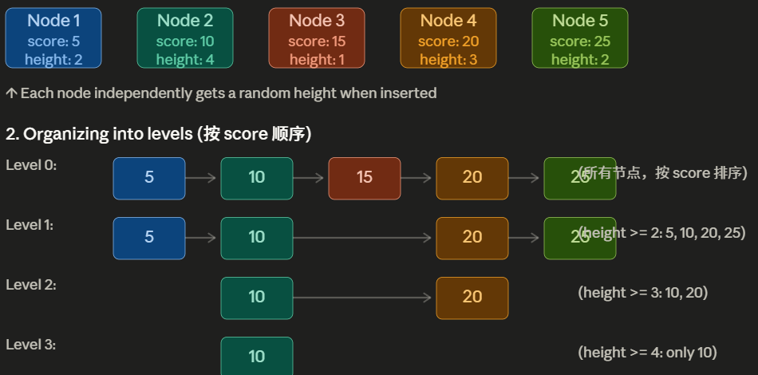
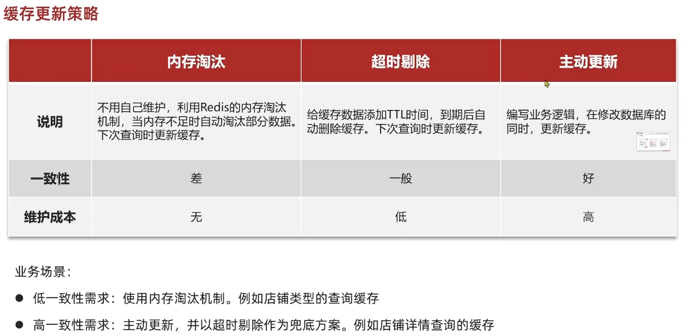
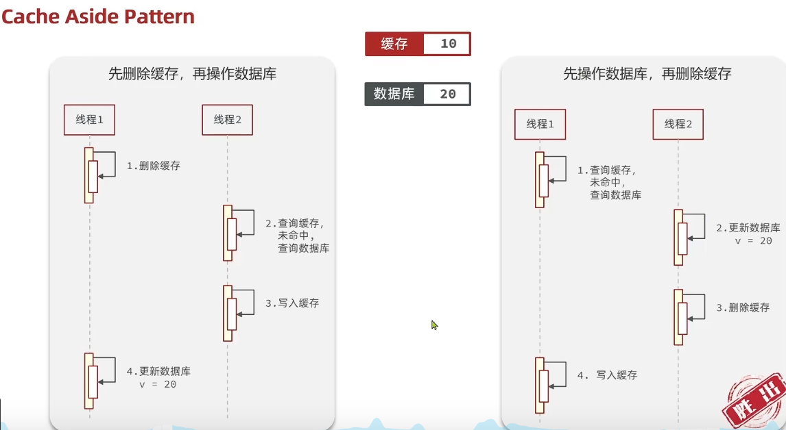
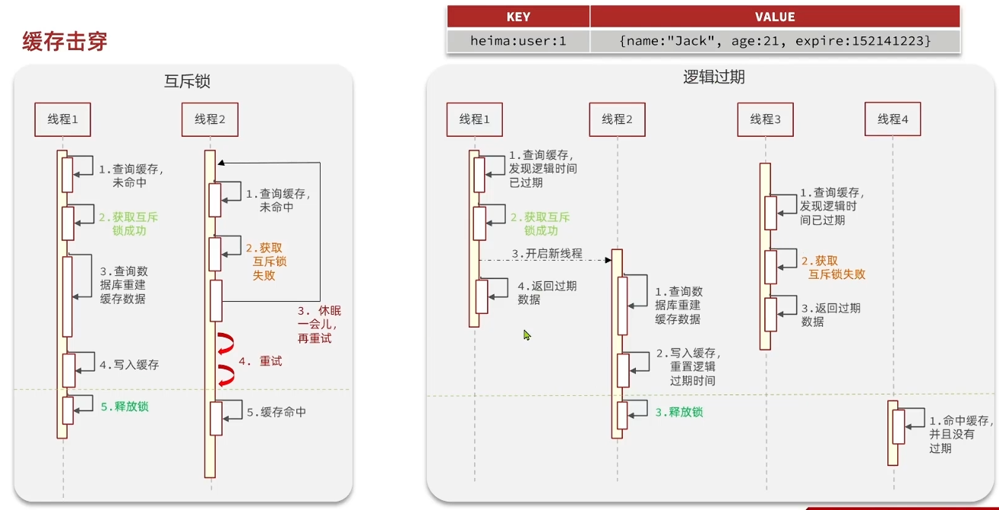
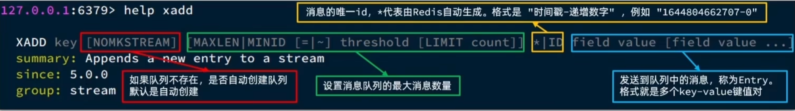
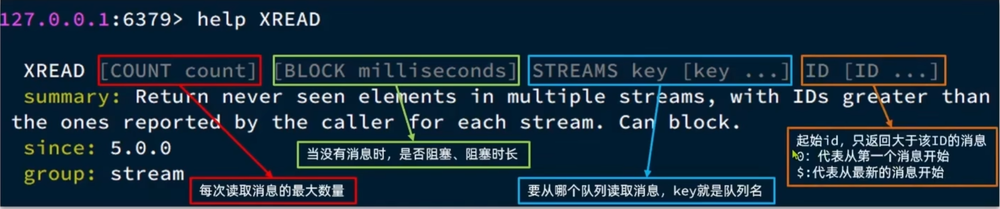
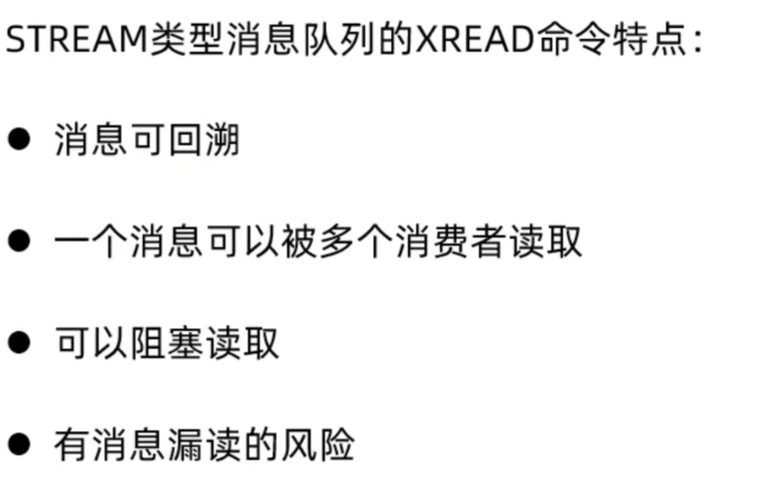
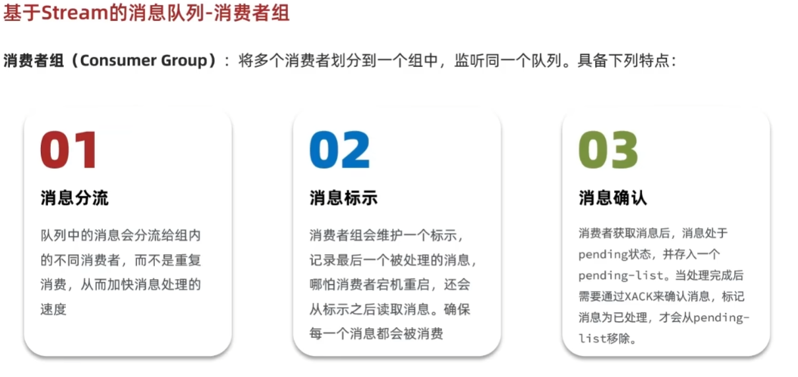
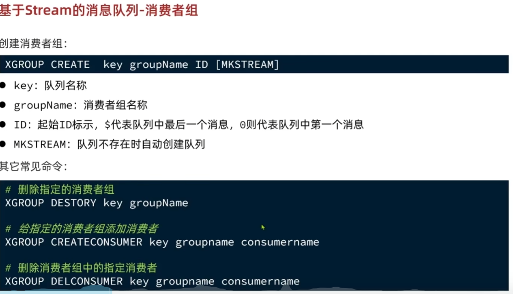
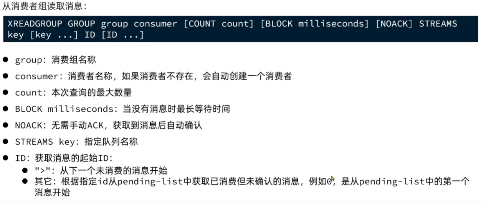

# redis
## 一、redis做缓存的优势


## 二、Redis 为什么这么快？
Redis 内部做了非常多的性能优化，比较重要的有下面 4 点：

1. **纯内存操作 (Memory-Based Storage)** ：这是最主要的原因。Redis 数据读写操作都发生在内存中，访问速度是纳秒级别，而传统数据库频繁读写磁盘的速度是毫秒级别，两者相差数个数量级。
2. **高效的 I/O 模型 (I/O Multiplexing & Single-Threaded Event Loop)** ：Redis 使用单线程事件循环配合 I/O 多路复用技术，让单个线程可以同时处理多个网络连接上的 I/O 事件（如读写），避免了多线程模型中的上下文切换和锁竞争问题。虽然是单线程，但结合内存操作的高效性和 I/O 多路复用，使得 Redis 能轻松处理大量并发请求（Redis 线程模型会在后文中详细介绍到）。
3. **优化的内部数据结构 (Optimized Data Structures)** ：Redis 提供多种数据类型（如 String, List, Hash, Set, Sorted Set 等），其内部实现采用高度优化的编码方式（如 ziplist, quicklist, skiplist, hashtable 等）。Redis 会根据数据大小和类型动态选择最合适的内部编码，以在性能和空间效率之间取得最佳平衡。
4. **简洁高效的通信协议 (Simple Protocol - RESP)** ：Redis 使用的是自己设计的 RESP (REdis Serialization Protocol) 协议。这个协议实现简单、解析性能好，并且是二进制安全的。客户端和服务端之间通信的序列化/反序列化开销很小，有助于提升整体的交互速度。

补充：
redis的单线程是对于处理指令的主线程，对于IO来说是多线程的：
* 多线程获取请求和返回处理结果，所有请求和结果回放在线程池中供redis（取走后单线程执行）和客户端取走
* 多线程IO能都同时处理多个客户端之间的响应，提升效率且不影响redis的原子性

## 三、redis实现分布式锁
### 实现方式：
1. 早期`SETNX`相较于一般的set可以实现整一个redis互斥，仅当设置key不存在才会创建新key。
2. SET lock_key value NX EX 30（将枷锁和设置时间放在一条指令中）
3. lua脚本
4. redisson客户端封装有分布式锁

### 2、删除操作常需要先判定锁是否为所需要删除的锁，然后再删除。这里出现两步操作无法确保原子性，所以可用lua脚本实现
### 3、可重入锁：同一个进程有多次获取同一把锁的操作，非重入锁是不和线程绑定的，只有有获取的请求就会锁上而不管其他请求是不是同一个线程。
* 线程内记录锁的key以及计数器，只有当线程首次获取锁才连接redis获取，其余获取直接判断本地key值后操作计数器。
* 释放锁次数也要和申请锁词数一致，只有当最后计数器减为0才会连接redis进行lua脚本释放锁

## 四、redis的value基本数据结构
### 【1】String vs Hash
简单对比一下二者：

- **对象存储方式**：String 存储的是序列化（java对象转换为可存储、运输的类型如json）后的对象数据，存放的是整个对象，操作简单直接。Hash 是对对象的每个字段单独存储，可以获取部分字段的信息，也可以修改或者添加部分字段，节省网络流量。如果对象中某些字段需要经常变动或者经常需要单独查询对象中的个别字段信息，Hash 就非常适合。
- **内存消耗**：Hash 通常比 String 更节省内存，特别是在字段较多且字段长度较短时。Redis 对小型 Hash 进行优化（如使用 ziplist 存储），进一步降低内存占用。
- **复杂对象存储**：String 在处理多层嵌套或复杂结构的对象时更方便，因为无需处理每个字段的独立存储和操作。
- **性能**：String 的操作通常具有 O(1) 的时间复杂度，因为它存储的是整个对象，操作简单直接，整体读写的性能较好。Hash 由于需要处理多个字段的增删改查操作，在字段较多且经常变动的情况下，可能会带来额外的性能开销。

总结：

- 在绝大多数情况下，**String** 更适合存储对象数据，尤其是当对象结构简单且整体读写是主要操作时。
- 如果你需要频繁操作对象的部分字段或节省内存，**Hash** 可能是更好的选择。

### 【2】Zset有序集合
#### Q1：存储结构
本质上也是键值对，只是键变为score，值变为数据。

一般情况下score只是作为排序的基准，但是相较于Hash（键值对肯定都作为要被存储的数据）来说zset自带一些额外功能，如score范围筛选，给出排行第几的数据等

但是score也能作为被存储的数据，如步数排行榜，score记录步数，且排行依据也是部署。


#### Q2: 底层skip-list跳表实现
跳表实现原理：

本质是添加一个随机生成的height，每一层level会排除掉height比自己低的节点。
```text
跳表示意图（查找元素 17）：

Level 3:  head ──────────────────────→ null
           ↓
Level 2:  head ────────→ 9 ──────────→ 25 → null
           ↓             ↓              ↓
Level 1:  head ─→ 6 ─→ 9 ─→ 13 ──→ 25 → null
           ↓      ↓    ↓    ↓      ↓
Level 0:  head → 3 → 6 → 9 → 13 → 17 → 25 → null

查找 17 的过程：
1. 从 Level 3 开始，head 没有下一个，下降
2. Level 2：head → 9（9 < 17）→ 25（25 > 17），下降
3. Level 1：9 → 13（13 < 17）→ 25（25 > 17），下降
4. Level 0：13 → 17（找到！）

总共比较 5 次，而普通链表需要比较 13 次
```

#### Q3:底层为什么要用跳表，而不用平衡树、红黑树或者 B+ 树？
这道面试题很多大厂比较喜欢问，难度还是有点大的。

- 平衡树 vs 跳表：平衡树的插入、删除和查询的时间复杂度和跳表一样都是 **O(log n)**。对于范围查询来说，平衡树也可以通过中序遍历的方式达到和跳表一样的效果。但是它的每一次插入或者删除操作都需要保证整颗树左右节点的绝对平衡，只要不平衡就要通过旋转操作来保持平衡，这个过程是比较耗时的。跳表诞生的初衷就是为了克服平衡树的一些缺点。跳表使用概率平衡而不是严格强制的平衡，因此，跳表中的插入和删除算法比平衡树的等效算法简单得多，速度也快得多。
- 红黑树 vs 跳表：相比较于红黑树来说，跳表的实现也更简单一些，不需要通过旋转和染色（红黑变换）来保证黑平衡。并且，按照区间来查找数据这个操作，红黑树的效率没有跳表高。
- B+ 树 vs 跳表：B+ 树更适合作为数据库和文件系统中常用的索引结构之一，它的核心思想是通过可能少的 IO 定位到尽可能多的索引来获得查询数据。对于 Redis 这种内存数据库来说，它对这些并不感冒，因为 Redis 作为内存数据库它不可能存储大量的数据，所以对于索引不需要通过 B+ 树这种方式进行维护，只需按照概率进行随机维护即可，节约内存。而且使用跳表实现 zset 时相较前者来说更简单一些，在进行插入时只需通过索引将数据插入到链表中合适的位置再随机维护一定高度的索引即可，也不需要像 B+ 树那样插入时发现失衡时还需要对节点分裂与合并。

一篇文章从有序集合的基本使用到跳表的源码分析和实现，让你会对 Redis 的有序集合底层实现的跳表有着更深刻的理解和掌握：[Redis 为什么用跳表实现有序集合](https://javaguide.cn/database/redis/redis-skiplist.html)。


## **五、redis持久化操作**
### 【1】RDB
1. Redis 可以通过创建快照来获得存储在内存里面的数据在 某个时间点 上的副本（按照物理分页一页一页存储）。Redis 创建快照之后，可以对快照进行备份，可以将快照复制到其他服务器从而创建具有相同数据的服务器副本（Redis 主从结构，主要用来提高 Redis 性能），还可以将快照留在原地以便重启服务器的时候使用。

2. Redis 提供了两个命令来生成 RDB 快照文件：
   * save : 同步保存操作，会阻塞 Redis 主线程； 
   * bgsave : fork 出一个子进程，子进程执行。

3. bgsave情况下出现COW（copy-on-write）
* COW是操作系统处理文件常用的策略，不止出现在redis中，只是bgsave使用fork（）创建新线程触发的COW
* bgsave创建一个子线程后，子线程与主线程开始时共用所有的物理页数据
* 当主线程某一页数据被修改时，为了保护持久化瞬间的数据，redis会将所有数据页都设置为只读。所以主线程此时会报缺页中断，但是操作系统会从页中线程计数（记录当前使用该页的线程数）不为1发现这是COW情况，然后会分配新页（新页是可写可读）给**主线程**，并把原页复制到新页中再修改。
* 注意COW的对象是一页，若某一页数据未更改，那么在子进程完成持久化之前两个线程都是共用这个页数据的（只读）。在子进程完成后仍然保持只读，知道修改时报缺页中断错误，操作系统才会审查其中的线程计数（记录当前使用该页的线程数）为1此时才修改权限（十分注意，这里不是在子进程完成任务销毁时就回调权限，而是修改时才修改权限，体现操作系统设计的慵懒性，不必要不紧急的任务能拖则拖，吧性能用在紧急的上面）
* 注意从页中线程计数（记录当前使用该页的线程数）不为1发现这是COW情况，这个判断不完全严谨，操作系统中判定COW有更多的依据 

4. Linux的THP导致COW花销过多->redis缓存崩溃
    * THP是Linux中2MB的大页，是由一般的页面（4kb）合并而成
    * 合并（增大页存储量，减量少页的数）是为了减少记录各页数据的页表大小，同时减少TLB（页表快速缓存）的miss
    * 补充：页是存储数据的基本结构，页表是记录各页信息的表，用于操作系统快速定位页以及知道页的大致信息；

5. 高读写情况下COW风险:写操作发生在大范围的不同页上，会导致大范围复制页，从而内存暴增
 
### 【2】AOF
1. AOF 持久化操作
```text
命令追加（append）：所有的写命令会追加到 AOF 缓冲区中。
文件写入（write）：将 AOF 缓冲区的数据写入到 AOF 文件中。这一步需要调用write函数（系统调用），write将数据写入到了系统内核缓冲区之后直接返回了（延迟写）。注意！！！此时并没有同步到磁盘。
文件同步（fsync）：这一步才是持久化的核心！根据你在 redis.conf 文件里 appendfsync 配置的策略，Redis 会在不同的时机，调用 fsync 函数（系统调用）。fsync 针对单个文件操作，对其进行强制硬盘同步(文件在内核缓冲区里的数据写到硬盘)，fsync 将阻塞直到写入磁盘完成后返回，保证了数据持久化。
文件重写（rewrite）：随着 AOF 文件越来越大，需要定期对 AOF 文件进行重写，达到压缩的目的。
重启加载（load）：当 Redis 重启时，可以加载 AOF 文件进行数据恢复。
```
2. AOF文件同步（刷盘）策略
    * always：每次写操作都进行使用主线程同步（会阻塞）。
    * everysec：写完立即返回，交由后台线程每秒调用一次fsync函数进行同步
    * no:写完即返回，同步时机有操作系统决定。

3. 文件重写的策略：
    * 本质是将原AOF文件终态数据原封不动记录下来，但是是用更少的空间
    * 直接扫描安当前redis内存快照，根据数据获得最简生成指令，然后写入AOF中


## 六、redis的过期删除策略
1. **惰性删除**：只会在取出/查询 key 的时候才对数据进行过期检查。这种方式对 CPU 最友好，但是可能会造成太多过期 key 没有被删除。
2. **定期删除**：周期性地随机从设置了过期时间的 key 中抽查一批，然后逐个检查这些 key 是否过期，过期就删除 key。相比于惰性删除，定期删除对内存更友好，对 CPU 不太友好。
3. **延迟队列**：把设置过期时间的 key 放到一个延迟队列里，到期之后就删除 key。这种方式可以保证每个过期 key 都能被删除，但维护延迟队列太麻烦，队列本身也要占用资源。
4. **定时删除**：每个设置了过期时间的 key 都会在设置的时间到达时立即被删除。这种方法可以确保内存中不会有过期的键，但是它对 CPU 的压力最大，因为它需要为每个键都设置一个定时器。

redis中常用懒惰删除和定期删除

## 七、redis内存淘汰策略（当内存超过限额时会淘汰哪些数据）
1. **volatile-lru（least recently used）**：从已设置过期时间的数据集（`server.db[i].expires`）中挑选最近最少使用的数据淘汰。
2. **volatile-ttl**：从已设置过期时间的数据集（`server.db[i].expires`）中挑选将要过期的数据淘汰。
3. **volatile-random**：从已设置过期时间的数据集（`server.db[i].expires`）中任意选择数据淘汰。

4. **allkeys-lru（least recently used）**：从数据集（`server.db[i].dict`）中移除最近最少使用的数据淘汰。
5. **allkeys-random**：从数据集（`server.db[i].dict`）中任意选择数据淘汰。
6. **no-eviction**（默认内存淘汰策略）：禁止驱逐数据，当内存不足以容纳新写入数据时，新写入操作会报错。

4.0 版本后增加以下两种：

7. **volatile-lfu（least frequently used）**：从已设置过期时间的数据集（`server.db[i].expires`）中挑选最不经常使用的数据淘汰。
8. **allkeys-lfu（least frequently used）**：从数据集（`server.db[i].dict`）中移除最不经常使用的数据淘汰。

补充：
1. 最近最少使用：检测最近使用的次数最少的
2. 最不经常使用：检测全局时间中使用次数最少的

## 八、影响redis性能的因素
1. **持久化操作中采用主线程堵塞方式**
2. **频繁执行一些时间复杂度O(n)的指令（慢查询指令）**
```
KEYS *：会返回所有符合规则的 key。
HGETALL：会返回一个 Hash 中所有的键值对。
LRANGE：会返回 List 中指定范围内的元素。
SMEMBERS：返回 Set 中的所有元素。
SINTER/SUNION/SDIFF：计算多个 Set 的交集/并集/差集
```
3. **大量key过期**

导致redis自执行定期删除任务（需要主线程阻塞执行）耗费过多性能，导致性能下降

核心是因为redis中的定期删除逻辑中加入了贪心：当随机选择的样本中过期数据超过限值，会触发再次选择样本检查

所以在大量key过期情况下，定期删除回不断贪心检查堵塞主线程

4. **热点key的压力过大**

热点key可以采用逻辑过期时间来解决：设定逻辑过期时间字段，采用懒惰检测。当热点key检测到逻辑过期，直接返回过期数据，同时将互斥锁锁上并开辟子进程进行数据更新。当其他请求发现过期了但是锁被锁（知道已经在更新但是没更新完），也直接返回过期数据。

## 九、redis保持数据一致性方式：




### 主动更新策略
1. 由缓存的调用者去实现，当数据库修改的时候同步到缓存中（一般方案）
2. 只操作缓存，对数据的不一致性由异步操作来实现数据库更新（不可靠性：一旦redis宕机，一段时间内大量数据都将丢失。复杂性。较少用）

相关问题：
1. 当更新缓存数据时多用删除数据而不是更新数据，可以避免高并发写数据库操作但是没有读数据库操作的情况，只有当要读数据发现缓存不存在时才更新缓存。
2. 通过事务实现缓存与数据库操作的原子性
3. 由于数据库更新相较其他操作更慢，一般先更新数据库后删除缓存（出错概率低）



## 十、redis生产场景各种问题解决方案

### 【1】缓存穿透问题
定义：恶意触发多次的数据库请求（编造虚假但合法id进行请求），且数据库本就没有该请求的数据，缓存redis自然也没有该数据，所以直接穿透缓存使数据库压力骤增
方法防范（逻辑主要是在访问数据库前添加层层判断，减少数据库的访问量）
1. 基础在代码逻辑中加入id判断，界定大致范围，否则无法响应
2. 当第一次缓存穿透时（即请求在数据库中不存在），则讲该字段存入redis缓存中并设为null，同时要设定较短的ttl，防止后面数据不一致。
3. 较高级：布隆过滤器（用多个哈希函数 + 位数组，来判断一个元素“是否可能存在），将所有哦已存在id加入过滤器中判断。可以存储在服务器本地也可以用redis缓存。
4. 布隆过滤器数据一致性问题：全量初始化（系统启动时扫描全部数据进行迁移）+ 增加数据时更新 + 定时校验（一部分或全量都可以）
5. 布隆过滤器缺点：误判（hash基本问题）；无法删除（多个元素共用bit位置，但可以用计数布隆过滤器解决）

### 【2】缓存雪崩
定义：redis同一时段多个key超时销毁或者redis宕机，导致短时内数据库高次数被直接访问而崩溃
解决办法：
1. 多级缓存
    * 本地缓存+单层redis：
    * 多层redis：还分为大小redis（小redis追求速度快如热点key，大redis为全量数据托底）和多个相同redis（分类存储）的情况
2. 对数据的ttl添加随机性，末尾加随机数

### 【3】缓存击穿问题
定义：高并发的场景下的key超时失效或者缓存重建很复杂需要较长时间，那么这段时间内就会直接到达数据库导致崩溃


#### 解决办法一、互斥锁
* 当要进行数据库更新操作的时候加上线程互斥锁，那么就能保证数据库一段时间内只被一个线程更新。但是未得到锁的线程会等待，降低性能

#### 解决办法二、逻辑过期：常用于解决热点商品key失效那一类问题（所以默认提前存入热点key到缓存中）
* redis设定逻辑过期时间字段，当查询redis过期且互斥锁未上锁时，直接返回过期数据并进行互斥锁上锁，并让另一个线程进行更新操作。
* 查询redis过期且互斥锁上锁，直接返回过期数据


## 十一、redis集群
### 演变历程
1. 单一redis面临单一服务器资源瓶颈、读写操作压力瓶颈、数据存储瓶颈、单点故障可用性低的难题
2. redis主从节电模式，通过主从复制环节数据读取压力，单纯多个redis服务器拓展（每一个节点都存储全量数据）：选择一个主节点进行数据写入，其他从节点进行数据读取，当主节点挂了，需要人工干预选择新主节点
3. 哨兵模式：解决主从节点模式中需要人工干预才能更换新主节点的问题，通过新增多个哨兵进程（实际会使用复杂raft算法选出一个leader哨兵进程（因为这个机制，所以哨兵进程一般是奇数个且至少3个），其他哨兵只是旁观，只是为了保证高可用性一直有哨兵进程在），通过衡量复制数据多少，id,初始配置文件等选出新主节点
4. 哨兵模式和分片集群都是采用主管下线、客观下线原则，只有半数以上的节点认为其下线才会客观下线，避免网络波动等导致的误判
### 分片集群
集群平均分配16000+个哈希槽给多个主从节点的主节点，这些主节点只存储一部分数据（相比于主从，写压力以及存储压力释放）。

各个节点间通讯采用gossip协议，所有节点一定时间都会ping其他一部分节点，如何发送该节点当前信息

由于使用gossip通信，则不适用哨兵极值在每一个主从节点内选举，而是直接通信选举新主节点

分片规则：官方使用CRC16进行分片（CRC16(key)%16384）定位到对于哈希槽，CRC本质是一个哈希函数（把输入数据看作一个二进制多项式，与一个固定的生成多项式做模2除法，余数即为 CRC 值s）

# redis stream
## 一、基本问题
1. 为什么选择redis stream
    * 相比于成熟的大型消息队列Kafka，RabbitMQ，redis支持中小型项目且本身使用redis进行缓存，不必再引用一个复杂的消息队列
    * 相比于使用postgresSQL的消息队列模式，由于postgresSQL是主数据库且担任向量数据库的职责，相对与redis来说更重要。那么对于消息队列这种有一定压力的数据库皂搓，还是交给redis以减少postgres压力。
2. 为什么使用redis的list实现阻塞队列，相比于JVM中的阻塞队列有什么优缺点
    * JVM的阻塞队列是在JVM内存中存储，JVM内存是配置文件设定的一个堆内存（512MB-4GB），一般小于本地内存RAM；redis则存储空间则是本地内存RAM，一般较大
    * redis支持持久化，哪怕宕机数据也能保存下来，JVM内则不能保证数据持久存在
    * redis可以用list结构中的LPUSH与RPOP实现队列，而使用BRPOP可以实现阻塞功能。完全能实现阻塞队列效果
    * redis可能出现消息丢失：BRPOP原理是将消息移除再处理，如果移除后消费者被挂起，那么该消息就永久丢失，也不能被其他消费者捕获来弥补执行！！
    * redis仅支持单消费者，不支持多个消费者都要取某一个消息

## 二、具体实现
* streams是redis一种新的数据类型，与list，hash同级别
* 里面数据是持久化的，不会因为取走而消失

1. 发送消息：


#### 接收消息：



* 同一时间内多条消息到达消息队列，而指定$是只读最新的一条，则会漏读消息

2. 消费者组解决消息漏读
* 介绍：
  
* 创建消费者组
  
* 读取消息
  
* 查询pending_list
  
  第4个参数（可选）是空闲时间：到队列之后等待的时间范围，超过则不放入pending_list中
  5、6参数是获取的消息id最小值和最大值构成的一个范围，用- +表示所有范围
  7参数是消息数量

## 三、抽象生产者、消费者（对于简历分析，RAG向量化，模拟面试等场景使用消息队列）
### 1、producer：组装消息、写入Stream、发送失败后的状态兜底
### 2、consumer：初始化消费者组、生成唯一consumerName、启动单线程循环、ACK、重试、 错误截断
### 3. 执行周期：
```text
SpringBoot启动
│
├─ 扫描Bean，实例化该类
│
├─ @PostConstruct → init()
│   ├─ 生成 consumerName（UUID）
│   ├─ 创建普通线程池（1个核心线程）
│   ├─ running.set(true)
│   └─ executorService.submit(this::startConsumer)
│       └─ 立即返回，init()结束，主线程继续启动其他Bean
│
└─ SpringBoot启动完成

【与此同时，线程池中的线程在跑】
    startConsumer()
    ├─ createStreamGroup()  建立消费组
    └─ consumeLoop()
        └─ while(running) {
               streamConsumeMessages(...)  // 阻塞轮询 Redis Stream
           }
```
* 后续只要有producer向stream中发送消息，comsumer会实时等待进行执行

## 四、分析重试问题（设置重试最大词数）
* 消费者每一次取消息进行分析，但是分析失败会放到失败队列中等待
* 对失败的信息进行确定（比如是分析简历的信息，对应的consumer逻辑就要检测简历还是否存在等信息，尽量避免再次失败）
```
 @Override
    protected void processBusiness(AnalyzePayload payload) {
        Long resumeId = payload.resumeId();
        if (!resumeRepository.existsById(resumeId)) {
            log.warn("简历已被删除，跳过分析任务: resumeId={}", resumeId);
            return;
        }

        ResumeAnalysisResponse analysis = gradingService.analyzeResume(payload.content());
        ResumeEntity resume = resumeRepository.findById(resumeId).orElse(null);
        if (resume == null) {
            log.warn("简历在分析期间被删除，跳过保存结果: resumeId={}", resumeId);
            return;
        }
        persistenceService.saveAnalysis(resume, analysis);
    }
```
* 对失败信息检测后，再次放入消息队列并将词数减1（记录在新消息中），每一次事务重试都是再次存入队列，而不是直接再分配给消费者立刻重试。
* **注意！：原失败消息一定要ACK,否则会导致失败消息堆积，内存消耗**，


## 五、内存问题（无限制消息队列一定要解决的关键问题！！！）
* 由于使用无限制队列进行消息队列线程存储，所以容易出现OOM情况
* 设定MAXLEN限定最大消息数，防止OOM
* 使用stream自带的模糊剪枝进行限定
```angular2html
StreamAddArgs.entries(message).trimNonStrict().maxLen(maxLen)
//去掉trimNonStrict()就是精确剪枝，会先计算需要裁剪精确数量，从旧数据开始裁剪（即编号小的数据），然后减去1-对应编号的数据
//模糊剪枝是按照块进行剪枝（redis底层就是使用块进行存储），计算删除数量，从旧数据开始裁剪，但是是裁剪整一个快，不会拆开某一个块进行裁剪。
```

## 六、优化点1（TODO）：对于某一个消费者宕机情况下将消息堆放在pending队列中造成内存过大
1. 解决方法：设定一个stream monitor类（专门实现stream中某些功能），定期扫描pending表中长时间未ACK的消息，通过器stream key识别业务类型，交给对应业务stream并作前置检查（process business函数）
2. 注意要加入分布式锁，由于是一个生产者多个消费者会导致线程问题，锁确保一个时间只有一个消费者扫描pending序列和或取信息。


