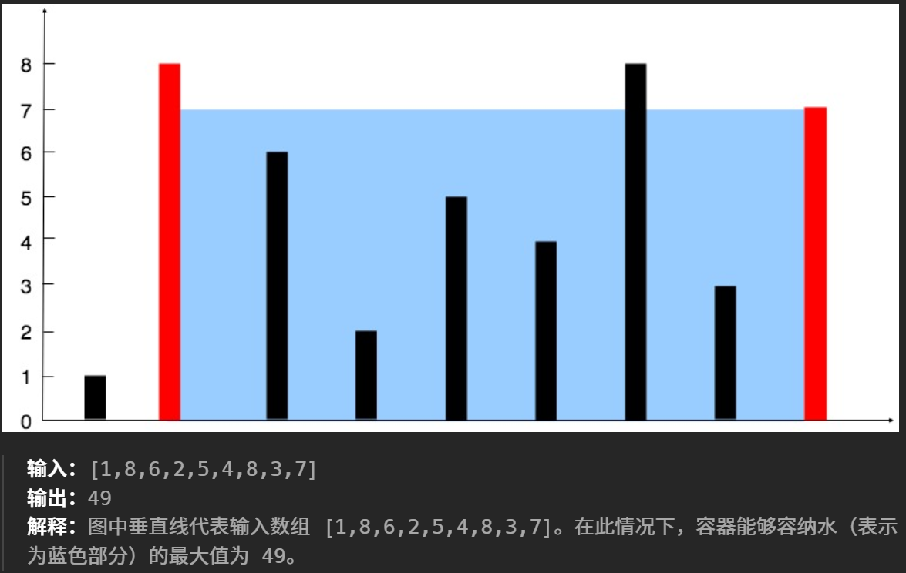

# set与map
## 【1】
```text
给定一个整数数组 nums 和一个整数目标值 target，请你在该数组中找出 和为目标值 target  的那 两个 整数，并返回它们的数组下标。
你可以假设每种输入只会对应一个答案，并且你不能使用两次相同的元素。
你可以按任意顺序返回答案
```

法一：遍历
法二：map记录

## 【2】字母异位词
```text
给你一个字符串数组，请你将 字母异位词 组合在一起。可以按任意顺序返回结果列表
输入: strs = ["eat", "tea", "tan", "ate", "nat", "bat"]
输出: [["bat"],["nat","tan"],["ate","eat","tea"]]
```

方法；异味通过sort实现顺序化->map的键存储顺序化结果，值为同一类异位词数组

## 【3】最长连续序列
```text
给定一个未排序的整数数组 nums ，找出数字连续的最长序列（不要求序列元素在原数组中连续）的长度。
请你设计并实现时间复杂度为 O(n) 的算法解决此问题
输入：nums = [100,4,200,1,3,2]
输出：4
解释：最长数字连续序列是 [1, 2, 3, 4]。它的长度为 4。
```

使用set存储所有数据，**然后遍历set**（注意该题是连续序列，所以重复数据不能组成连续序列）
若改为非递减序列则用map存储
当x-1也在set中则跳过该数据（说明该数据不是连续序列的起点）
当x-1不在set中while循环对x+1+1+...进行判断，直到x不在set中，然后比较ans


# 双指针
## 【1】后置0
```text
给定一个数组 nums，编写一个函数将所有 0 移动到数组的末尾，同时保持非零元素的相对顺序。
请注意 ，必须在不复制数组的情况下原地对数组进行操作。
输入: nums = [0,1,0,3,12]
输出: [1,3,12,0,0]
```

核心思想：后移0 == 前移非0元素
法一：非零元素直接赋值归位，第一次遍历遇到非零就往前赋值（维护一个最左非零元素赋值位），第二次遍历从维护的ind到末尾赋值0
法二（最优）：双指针，遇到非0直接交换该非零元素与维护的ind

## 【2】首尾双指针+单一移动趋势
```text
给定一个长度为 n 的整数数组 height 。有 n 条垂线，第 i 条线的两个端点是 (i, 0) 和 (i, height[i]) 。
找出其中的两条线，使得它们与 x 轴共同构成的容器可以容纳最多的水。
返回容器可以储存的最大水量。
说明：你不能倾斜容器。
```


使用首尾指针（优先宽度最大化）
找规律：对于一对木板，不移动短木板只移动长木板，宽度必然变小，高度会有两种情况：
1. 高度高于原长木板，但是由于短板效应，水面积不变
2. 高度低于/等于原木版，面积更小

而移动短木板不移动长木板，高度会有两种情况：
1. 高度低于原短木板，面积更小
2. 高度高于原木版，高度增加的面积与宽度减少的面积作比较，面积可多可少（优化点）

所以在宽度变小的情况下寻求更大水面积，一定是移动短木板