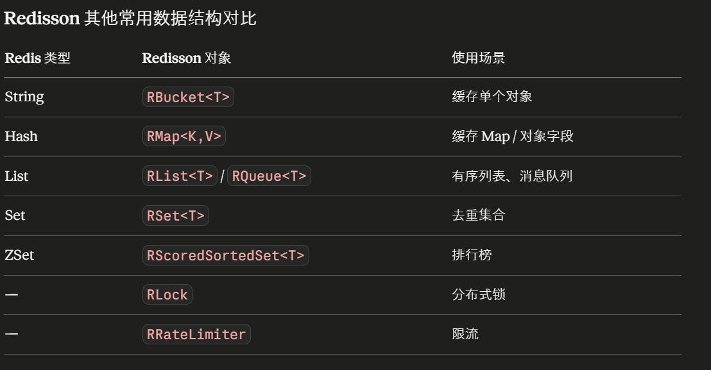
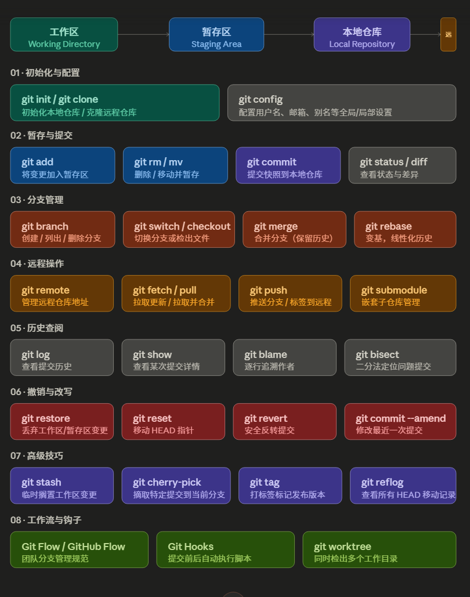
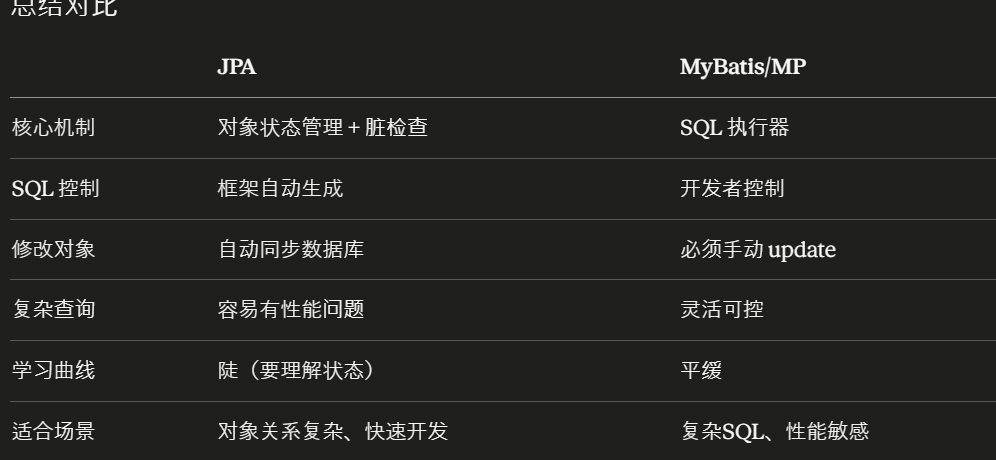
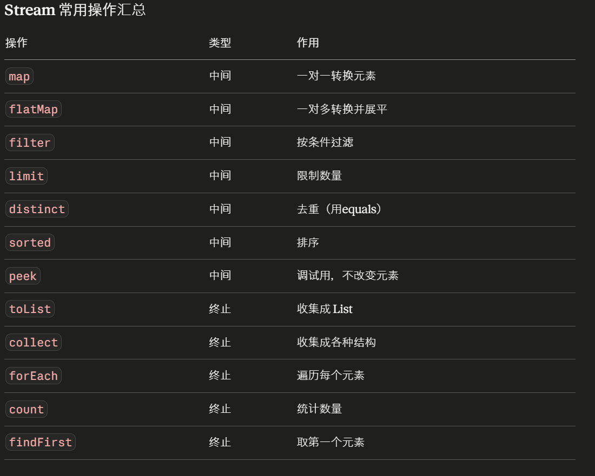

## 一、spring框架文件接口类MultipartFile（文件相关）
```
file.getOriginalFilename()  // 原始文件名，如 "resume.pdf"
file.getContentType()       // MIME类型，如 "application/pdf" "image/png"
file.getSize()              // 文件大小，单位字节
file.isEmpty()              // 是否为空文件
file.getBytes()             // 转为 byte[]（小文件用）
file.getInputStream()       // 转为输入流（大文件用，省内存）
file.transferTo(dest)       // 直接保存到本地 File 对象
```

## 二、UUID生成（出现于文件存储名称等命名中，防止出现重名覆盖原来文件）
1. java原生生成：
```angular2html
String uuid = UUID.randomUUID().toString();
// 结果：550e8400-e29b-41d4-a716-446655440000
```
2. 雪花算法（引入hutool依赖）
```angular2html
// 通常用 Hutool 工具库
Snowflake snowflake = IdUtil.getSnowflake(1, 1);
long id = snowflake.nextId();
// 结果：1674745614915993602（纯数字，有序）
// 时间戳(41位) + 机器ID(10位) + 序列号(12位)
```

## 三、正则语法：匹配字符+限定符（出现在使用正则对Tika转化的文本进行噪声人工去除）
1. 限定符（对前面字符的限定）
    * ？限定出现0/1次
    * +限定出现1次或以上
    * *限定出现0次或以上
    * {a,b}限定出现a到b次（含a含b，a默认0，b默认无穷）
    * ^匹配行首字符，且是唯一一个限定符在匹配字符前。$匹配行尾字符，在匹配字符后（^a,b$）
    * \b表示单词字符的边界，就是下一个字符是空白符
2. 匹配字符（对字符本身进行匹配）
    * 一般限定符默认只限定前一个字符
    * （）可以匹配多个字符，[]则是匹配所有由[]中字符组成的字符串（不限顺序不限数量）
    * [a-z]匹配所有小写字母，[A-Z]匹配所有大写字母，[0-9]匹配所有数字，[a-zA-Z0-9]匹配所有字母和数字。
    * 在[]前部加入^表示[]中范围所有取反，注意包含换行符等空白字符（例：[^0-9a-z]）
    * \d匹配所有数字，\D匹配所有非数字
    * \w匹配所有字母数字下划线，\W匹配所有非字母数字下划线
    * \s匹配所有空白字符，\S匹配所有非空白字符
    * .表示任意字符但不包含换行符

3. 贪婪策略和慵懒策略，常出现在.（表示任意字符除换行符之外）的限定中
    * 贪婪策略：匹配尽可能多的字符（默认贪婪策略）
    * 慵懒策略：匹配尽可能少的字符

例子:<123><asda231321><1231890##@(9)>   
这里使用<.+>就会贪婪匹配第一个<和最后一个>匹配，中间内容都是.改为<.+?>就换为慵懒策略，只用.匹配尽可能少字符，这样就能匹配出每一个<>的内容
但是要考虑<>中有空字符的情况时，上面那种就会有误匹配（<><1378138>为一个匹配项），所以可以使用<.*?>

4. 示例
* 实例1：[a-f0-9]{6}\b表示识别6位16进制的颜色值
* 实例2：ip地址
  * 限定0-255： (25[0,5]|2[0,4]\d|(0|1)?\d\d?)
  * .要使用转义符\.

## 四、record数据类型（java14+引入）
1. 用处：自动提供一个final类的构造方法、getter方法以及equals，hashcode，toString等基本方法
2. 与Lombok的@data注解十分类似，但是也有不同点如下：
    * @Data注解类的方法可以手动修改且也能继承其他类，record不可
    * getter风格不一样，@Data是get...(),record是方法与字段同名

 


## 五、守护线程（Thread.setDaemon（true））
1. 收到关闭信号时，JVM会立刻自动关闭所有守护线程。一般线程在收到信号后JVM会等待线程的事务操作（数据库操作等）结束才会关闭，会让JVM干等。
2. 对于突然关闭的事务操作，会根据状态进行回滚或者放行。
3. 常见后台/异步运行的线程设为守护线程

## 六、redisson：将redis返回的数据封装为java对象


1. 创建redisson对象getBucket（），这一步只是声明，获得句柄
2. 连接redis获取数据set(),get()等函数，这一步是实质操作数据库并有一些数据序列化操作（将数据封装为对应java类对象，通过传入的泛型确定DTO）

## 七、prompt注入方式
1. 在constants中写死每一个prompt且对于用户补充的信息通过Java逻辑代码手动填入。适合简单，不变的prompt注入
2. 使用SpringAI提供的prompt接口PromptTemplate，配合st文件进行prompt书写注入
    * 在st文件中的prompt是含有占位符的，用于传入用户所给的提示词信息，PromptTemplate自动注入进这些占位符
    * 对于多种环境下（开发，测试，生产...）的prompt是不同的，如果使用constants的化需要在注入prompt的时候进行if else判断，判断是散落在不同文件中的，不好维护；而PromptTemplate可以在yml中统一规定
    * 对于java文件在项目编译时都需要编译一次，而st文件时资源文件，无需编译只是被读取即可

## 八、大模型json输出结果的规范化
1. 在prompt中写明输出格式按json，并且包含哪些字段，字段含义...信息。但是这完全按照大模型去理解，有一定风险输出错误的json格式
2. 使用BeanOutputConverter<DTO>.getFormat()是根据DTO创建JSON标准输出格式，是标准答案。

## 九、Flux数据结构（流式响应返回的结构）
1. 定义：Spring WebFlux响应式编程的一种数据结构
2. 与java常规数据类型类比：
    * 返回单个值：String vs Mono<String>
    * 返回多个值：List<String> vs Flux<String>
3. 核心区别:
   * List<String> 是等所有数据都准备好才能拿到
   * Flux<String> 是数据一条一条异步推过来的，你不需要等全部完成。
4. 关键特性
    * **懒执行**：只有当有人订阅的时候才会执行响应代码块的逻辑 
    * **背压（Backpressure）**（十分重要的特性）：下游处理慢时可以通知上游降速，不会撑爆内存 
    * 可以是异步推送 0 到 N 个元素就结束，也可以是无限推送

## 十、响应式编程与订阅逻辑
1. 上下游概念：
    * 上游：输出流式响应的一方（LLM，传感器等）
    * 下游：调用、接收数据的一方
2. 响应式编程常用场景（传统后端项目不需要这么复杂的luoji）
* 大模型 / AI 相关
    * LLM 流式输出（就是你这个项目） 
    * AI 生成图片的进度推送 
    * 语音转文字的实时结果流
* 实时数据推送 
  * 股票/加密货币行情实时推送
  * 订单状态变更通知
  * 物联网设备传感器数据上报（温度、压力等持续上报）
* 消息队列消费 
  * Kafka、RabbitMQ 的响应式客户端（Reactor Kafka）
  * 消息源源不断进来，天然适合用无限流处理

3. 响应式编程出现情况：
    * 需要处理海量并发连接（比如 10 万个 WebSocket 连接）
    * 数据是持续流动而不是一次性的
    * 需要精细控制背压避免内存溢出

4. 订阅服务逻辑：Project Reactor 里对响应的一个控制器，能**主动**关停某一个流式响应
* 一般是下游主动关闭上游的响应
* **区分sink.complete()与disposable.dispose()**：
  * complete是上游向下游关闭流式响应，可能出现在正常传输完所有有用信息后关闭以及上游生产过程中报错向下游传输报错信息后关闭。且complete是关闭flux响应
  * disposable则是下游主动关闭（比如关闭LLM的浏览器页面了，关闭试试股票数据获取页面等），dispose是关闭某一次subscribe
```
interface Disposable {
    void dispose();   // 取消这次订阅（类比于java线程中的future，取消线程）
    boolean isDisposed(); // 是否已取消
}
```

5. **响应过程**
    * 首先对一次订阅进行初始化，创建一个flux以及对应的disposable与其映射
    * 在本次订阅通用一个sink（流式返回的数据结构FluxSink<String>）,在sink中通用一个subscribe“通道”。
    * 流式输出是在LLM没输出一个数据就使用subscribe通道进行传输一次
    * 上游输出完毕则由上游发出sink.complete告知下游不必在接受subscribe信息，然后上游也会关闭
    * 当下游出现中断、错误、取消订阅时，由下游发出disposable.dispose告知上游不再接受subscribe信息，然后手游便会强制关闭
    * 当出现中间层代码块（本项目探测窗口）的时候就要注意：complete只是告知下游自己不生产（下游也会对subscribe来的内容直接舍弃），但是并不意味这上游停止生产的逻辑包含在complete中，所以需要使用下游dispose终端上游的继续生产浪费。

## 十一、git指令
步骤：
```
git init //初始化
git add. //添加到本地git仓库文件
git commit -m "Initial commit" //添加描述
git remote add origin https://github.com/你的用户名/你的仓库名.git //链接远程仓库
git branch -M main // 跳转/新建分支
git push -u origin main // 推送到远程仓库对应分支
```


1. 初始化与配置 — git init 在本地新建仓库，git clone 从远程拷贝。git config 负责设置用户名、邮箱、默认编辑器、命令别名等，可作用于系统级、全局或单仓库级别。
2. 暂存与提交 — 这是 Git 最核心的日常循环：用 git add 将文件变更放入暂存区，再用 git commit 将快照写入本地仓库历史。git status / git diff 是两者之间的"查镜子"工具。
3. 分支管理 — git branch 创建/列出/删除分支，git switch（新式）或 git checkout 切换分支。合并有两种策略：git merge 保留完整历史，git rebase 将提交移植到目标分支末端，使历史呈线性。
4. 远程操作 — git fetch 仅下载不合并，git pull 等同于 fetch + merge/rebase。git push 将本地提交推送到远端，git remote 管理远程地址列表。
5. 历史查阅 — git log 是主力工具（配合 --oneline --graph --all 效果极佳），git blame 追溯每行代码的提交者，git bisect 用二分法快速定位引入 bug 的提交。
6. 撤销与改写 — 三个层次：git restore 丢弃工作区/暂存区变更（最安全），git revert 生成一个新的"反操作"提交（适合公共分支），git reset 直接移动 HEAD 指针（慎用于已推送的提交）。
7. 高级技巧 — git stash 是"抽屉"，临时藏起未完成的工作；git cherry-pick 精准摘取某个提交；git tag 标记发布版本；git reflog 是"后悔药"，记录所有 HEAD 变动，可找回误删的提交。
8. 工作流与钩子 — Git Flow 适合版本化发布产品，GitHub Flow 更适合持续集成。Git Hooks 允许在 pre-commit、post-merge 等时机自动执行脚本（如 lint、测试）。git worktree 可同时检出多个分支到不同目录。

## 十二、构建ChatClient和调用AI的区别
* 构建ChatClient是对大模型的定义：比如是否含有记忆功能，是否由Skillstool等
* 调用AI是使用某一类构建好的ChatClient来传入system prompt和user prompt来调用大模型

## 十三、数据存储字段的含义
1. po/entity: 对标数据库表的数据类，字段和数据库表字段对应，一般加入JPA或DP进行管理
2. repository：JPA体系下的mapper
3. mapper: mybatis中将po/entity映射到数据库字段的逻辑。mapstruct中作数据转换的类
4. DTO：接收和返回给前端的数据对象，只包含数据字段，不包含任何业务逻辑。

## 十四、两种数据库查询框架的结构区别（mybatis与JPA）
1. 结构：
    * mybatis：DTO->mapper(po)->数据库
    * JPA：DTO->repository(entity)->数据库
2. 底层区别

* JPA是完全不用开发者负责数据库查询语句书写，但是这种智能在面对复杂SQL语句的时候会有风险。而MP相比Mybatis主要是将CRUD省去

## 十五、stream流方法
* 各种数据类型都可以变为数据流（无论List<>内的是什么类型）

* **map方法**：对每个元素做同一种变换，返回新的 Stream，原始数据和数据流都不变
```Java
//本质是传入一个转换函数，使用lambda表达式就更直观 A->B
List<String> names = List.of("张三", "李四", "王五");

// String → Integer（字符串转长度）
List<Integer> lengths = names.stream()
    .map(name -> name.length())
    .toList();
// [2, 2, 2]

// String → User（字符串转对象）
List<User> users = names.stream()
    .map(name -> new User(name))
    .toList();
```