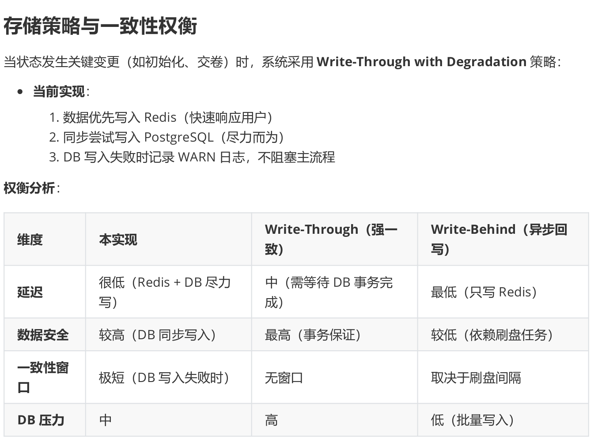
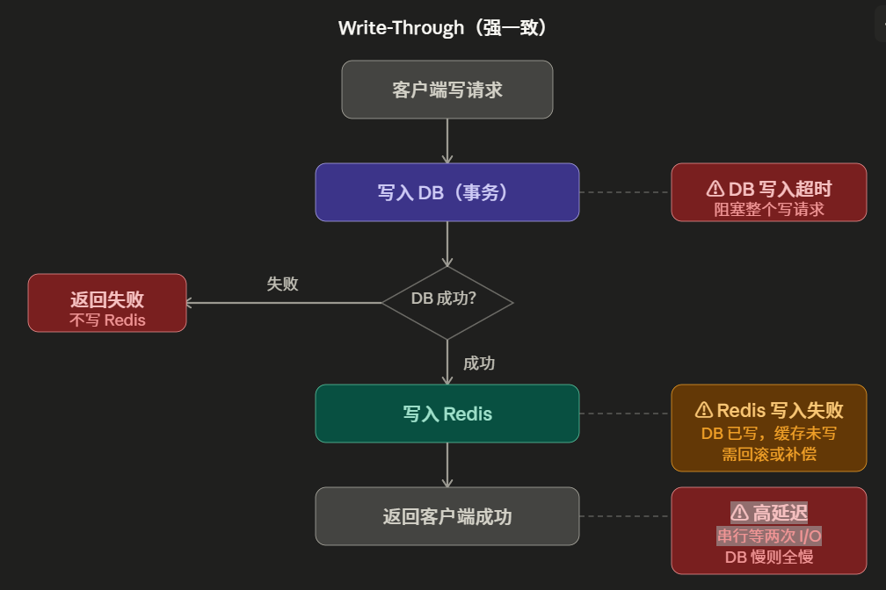
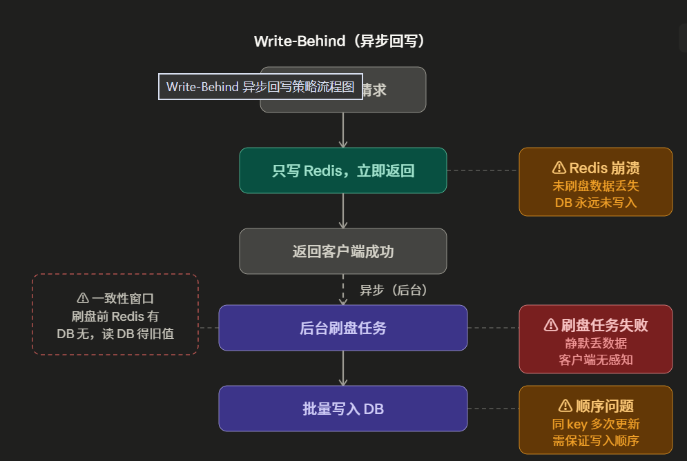
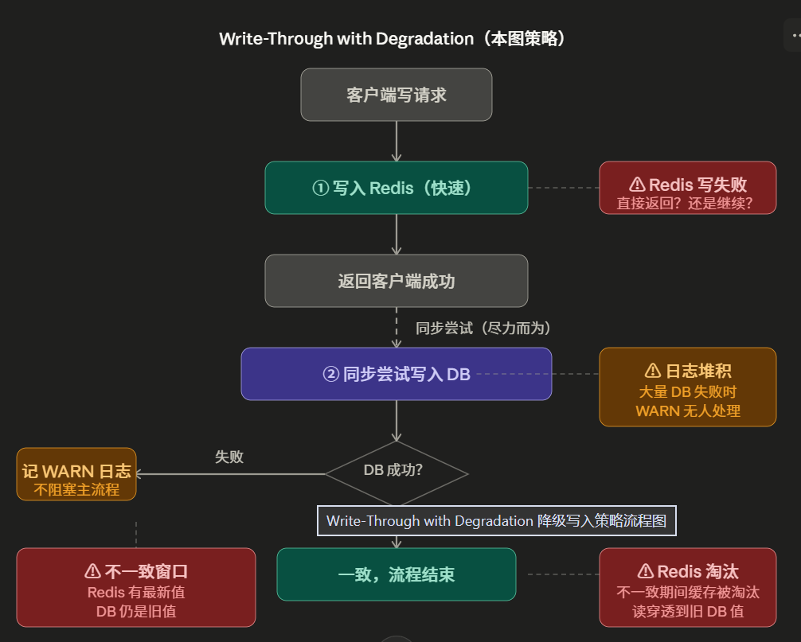

# AI模拟面试
## 一、面试出题
### 历史问题去重方案对比
1. 使用一般SQl数据库记录历史问题，当真正需要判断是否重复的时候使用StringBuilder构建一个字符串加入prompt，防止大模型生成重复问题
2. 使用向量数据库记录历史问题，对于生成的每一个问题都使用向量相似度搜索进行判断是否重复
    * 高精确度
    * 对于复杂的同类型问题可以被识别归类
    * token消耗急剧增大
    * 模拟面试场景也不需要避免复杂的同类型问题（即表述不一样，但是背后的原理和本质一样）

###  使用SQL存储而不使用带有memory的chatClient原因：
1. 会话记忆是非结构化文本，里面内容包含所有记忆，每次提取都需要将所有记忆中有关出题的部分都提取出来。而对于SQL数据库存储只需要每次出题存储即可，还能用Hash进行快速查找，
2. 会话记忆越多消耗token越来越多，而SQl数据库的消耗几乎微不足道

### 问题异步线程生成
1. 本质是希望两个线程同时生成两个方向的问题，节省效率
2. 由于需要涉及问题兜底，所以在判断两个线程是否完成的时候要一起判断：CompletableFuture.allOf(resumeFuture, directionFuture).join()，场景不建议设计优先级
3. 

### 问题兜底
1. 由于问题可能会有两个方面构成：简历题+方向题。
   * 当某一个异步线程生成问题出现报错，另一个方向的问题需要补全问题数量
   * 为了补生成的问题与已生成的问题不重复，应该先将已生成问题放入历史问题库（这里核心逻辑涉及面试对话interviewSessionDTO到historicalQuestion的转换），然后在传参给问题生成函数

2. 当两个方向都出问题，会设计有兜底问题（一般是普适使用的问题）

## 二、面试过程缓存与修复
### 缓存一致性策略 = 写入策略 + 淘汰策略
#### 写入策略

1. 强一致性策略：能保证redis与postgresSQL数据库的强一致性

缺点：两次串行执行效率低；一旦一致性没满足就直接阻断该任务；redis写失败会出现不一致性（看可以使用异步生产者再次写入redis，但是也会有不一致期）

2. 弱一致性策略：性能较高

缺点：若在刷盘操作前redis宕机这一批数据就直接丢失。依赖redis刷盘的成功性，刷盘失败写入重写队列操作也失败就会导致静默丢数据。
注意使用生产者队列存储redis刷盘重写操作一定要注意写数据顺序：这是 Write-Behind 最棘手的问题。同一个 Key 的 A→B→C 三次短时间更新，如果 A 写 DB 失败重入队列排到了 C 后面，最终 DB 会写成 A，数据回退。解决方式是给每条记录带上版本号或时间戳，消费时检查"当前 DB 版本是否比我旧"，是才写，否则丢弃。

3. 本项目策略：折中策略:相比与强一致性方案，只是在DB同步失败的时候只返回warn日志（默认省去加入重试消费者序列这一操作）

## 三、面试结果分批评估
1. 为什么采用分批评估
由于prompt以及大模型基本参数计算，大概10题面试题的所有信息（题目，作答，评价）比较合适。20题以上会超出部分模型上下文上限
2. 分批逻辑（两步会调用大模型）
    * 每一批一起传入**大模型评估**，并给出每一题具体评估以及该批次的优势点、提升点等批次评价
    * 包含将所有批次每一个单题评估结果合并
    * 包含将每一批次优势点、提升点合并
    * 最后将所有结果进行加权分析并**交给大模型整合**，给出合理的综合评价