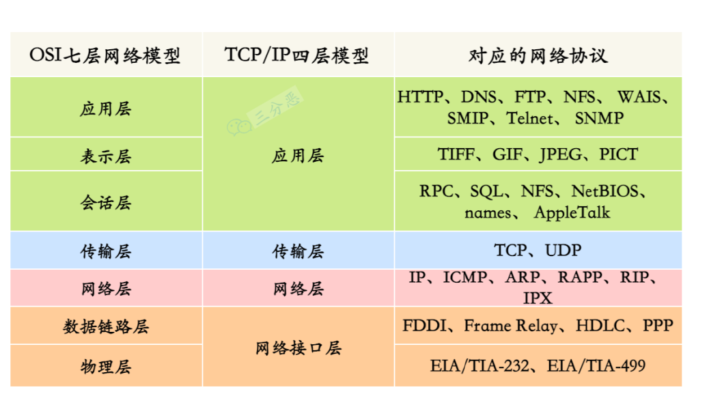

## 五层结构：
应用层->传输层->网络层->数据链路层->物理层

各层协议：

## 前后端联调与计算机网络关系

* 访问的URL结果DNS解析得到要连接的服务器IP地址
* 前端将信息、IP地址及其他信息封装在HTTP中，添加请求头和一些其他字段发送给传输层
* 传输层与对应的服务器进行连接（三次握手）
* 网络层正式开始传输消息，使用路由器跳转对应网关进行更底层操作，来实现进行一步一步的消息传输
* 链路层是物理MAC地址的跳转
* 物理层是将数字信号转换为物理信号
* 后端一步步解析，到应用层后使用jackson序列化json信息为DTO对象后进行数据操作并将result按照原路返回给浏览器请求者

## 常用服务的端口号

| 端口 | 协议 | 服务 / 软件 | 类别 | 说明 |
|------|------|------------|------|------|
| 3306 | TCP | MySQL / MariaDB | 数据库 | 最流行的开源关系型数据库 |
| 6379 | TCP | Redis | 数据库 | 高性能内存键值存储 / 缓存 |
| 5432 | TCP | PostgreSQL | 数据库 | 功能强大的开源对象关系型数据库 |
| 80 | TCP | HTTP | Web | 未加密 Web 流量标准端口 |
| 443 | TCP | HTTPS | Web | TLS/SSL 加密 Web 流量 |
| 8080 | TCP | HTTP 备用 / Tomcat | Web | 常用替代 HTTP 端口，Tomcat 默认 |
| 8443 | TCP | HTTPS 备用 / Tomcat | Web | Tomcat / 其他服务的 HTTPS 替代端口 |
| 22 | TCP | SSH / SFTP / SCP | 安全 | 加密远程登录与安全文件传输 |

## HTTP与HTTPS区别
HTTP和HTTPS的区别是HTTP是明文传输，HTTPS是加密传输。
* HTTPS对报文计入额安全协议
* HTTPS在正常三次TCP握手后还需要加密协议的握手过程才能连接

## TCP三次握手
### 【1】三次握手过程
1. 初始化客户端和服务端都是close状态，项目手动开始后服务器进入listen状态
2. 第一次握手：客户端向服务器发送SYN包并加入等待确认状态。
3. 第二次握手：服务器收到SYN包会判定是否接受连接，接收后会发出ACK+SYN报文，SYN报文是用于双端的基本信息如初始序列号
4. 第三次握手：客户端收到服务器的ACK报文并进入连接建立状态。服务器收到ACK报文也进入连接建立状态，且后续不会在发送确认报文

### 半连接和全连接队列（服务端）
1. 半连接队列：服务器发出第二次握手信息后保存第一次握手信息。如果客户端迟迟为确认就会采用重试策略。 
2. 全连接队列：三次握手以及完成，双端都进入连接建立状态，此时服务器会产出信息，该队列会存储哪些产生了但未被客户端取走的信息。 
3. 当全连接队列满了会有一定的处理策略

## restful规范

| 方法 | 作用 | 是否有 Body | 幂等性 | 请求格式示例 |
|------|------|------------|--------|-------------|
| **GET** | 获取资源，不修改服务器数据 | ❌ 无 Body | ✅ 幂等 | `GET /users/42 HTTP/1.1` `Host: api.example.com` `Authorization: Bearer <token>` |
| **POST** | 创建新资源，提交数据 | ✅ 有 Body | ❌ 非幂等 | `POST /users HTTP/1.1` `Host: api.example.com` `Content-Type: application/json`  `{"name": "张三", "age": 25}` |
| **PUT** | 全量替换已有资源 | ✅ 有 Body | ✅ 幂等 | `PUT /users/42 HTTP/1.1` `Host: api.example.com` `Content-Type: application/json`  `{"name": "张三", "age": 26, "email": "zs@example.com"}` |
| **PATCH** | 部分更新已有资源 | ✅ 有 Body | ✅ 幂等 | `PATCH /users/42 HTTP/1.1` `Host: api.example.com` `Content-Type: application/json`  `{"age": 26}` |
| **DELETE** | 删除指定资源 | ❌ 通常无 | ✅ 幂等 | `DELETE /users/42 HTTP/1.1` `Host: api.example.com` `Authorization: Bearer <token>` |
| **HEAD** | 获取响应头信息，不返回 Body，常用于检查资源是否存在或获取文件元信息 | ❌ 无 Body | ✅ 幂等 | `HEAD /files/video.mp4 HTTP/1.1` `Host: api.example.com` |
| **OPTIONS** | 查询服务器支持的请求方法，浏览器跨域时自动发起预检请求 | ❌ 无 Body | ✅ 幂等 | `OPTIONS /users HTTP/1.1` `Host: api.example.com` `Origin: http://localhost:3000` `Access-Control-Request-Method: POST` |

1. path路径参数（url重的{id}） get/delete
2. url中的query（在？拼接） get
3. 请求体body传递 post/put 
4. 请求头 所有方法皆可